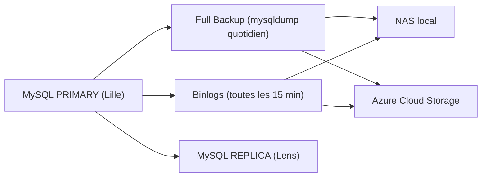

# **04.2 – Stratégie de Sauvegardes (RPO 15 min / RTO 1 h)**

## **1. Introduction**

La base MySQL du WMS est un composant critique de l’activité logistique : toute indisponibilité bloque immédiatement les réceptions, les mouvements de stock et l’expédition des commandes.  
La stratégie de sauvegarde doit garantir :

- une **perte maximale de données ≤ 15 minutes** (**RPO = 15 min**) ;
    
- une **restauration complète en moins d’une heure** (**RTO = 1 h**).

Les mécanismes MySQL (binlogs, mysqldump, PITR, réplica) permettent de répondre à ces exigences..

---

## **2. Objectifs de continuité**

- Garantir un RPO ≤ **15 minutes** grâce aux binlogs.
    
- Garantir un RTO ≤ **1 heure** grâce aux sauvegardes full + PRA.
    
- Fournir un historique complet des transactions (binlogs).
    
- Prévenir la perte de données via un stockage redondant (NAS + cloud).
    
- Permettre une restauration fiable à un instant précis (**PITR MySQL**).

---

## **3. Typologie des sauvegardes**

### **3.1 Sauvegarde complète (Full Backup – mysqldump)**

- Exécutée **une fois par jour** à 02h00 (fenêtre de charge faible).
    
- Commande type :

```bash
mysqldump --single-transaction --quick --lock-tables=false wms > /backups/dump_full.sql
```

- Contenu : schéma + données.
    
- Sert de base pour toute restauration complète (PRA).
    
- Stockage : NAS + copie vers Azure Cloud Storage.

### **3.2 Sauvegardes incrémentales – Binlogs MySQL**

Les **binlogs** (binary logs) enregistrent TOUTES les opérations écrites dans MySQL  
(INSERT, UPDATE, DELETE, CREATE…).

Ils permettent :

- de reconstruire l’historique complet des transactions ;
    
- de réaliser des sauvegardes incrémentales ;
    
- d’atteindre le **RPO = 15 minutes**.

Configuration recommandée :

```ini
log_bin = mysql-bin
binlog_format = ROW
expire_logs_days = 2
sync_binlog = 1
```


Rotation recommandée : **toutes les 15 minutes**.

### **3.3 Journaux de transaction / binlogs

- Indispensables pour la réplication MySQL (Primary → Replica).
    
- Indispensables pour la restauration précise à un instant donné.
    
- Export automatique vers NAS + Azure.
    
- Rétention locale courte (24–48 heures).

### **3.4 Point-In-Time Recovery (PITR – MySQL)**

Le **PITR (restauration à un instant précis)** combine :

1. le **full backup quotidien**,
    
2. la **relecture des binlogs** jusqu’à l’instant exact précédant l’incident.

Commande PITR :

```bash
mysqlbinlog --start-datetime="2025-01-01 12:00:00" /var/log/mysql/mysql-bin.000123 | mysql -u root -p
```

Permet de restaurer la base **à la minute près**, indispensable pour respecter un RPO très court.

## **4. Stockage et protection des sauvegardes**

### **4.1 Stockage local – NAS RAID**

- Stockage primaire des dumps + binlogs.
    
- NAS redondé (RAID 5/6).
    
- Accès restreint au compte `backup_user`.
    
- Snapshots locaux réguliers.

### **4.2 Stockage externalisé – Azure Cloud Storage**

- Copie quotidienne automatique des **full backups**.
    
- Envoi régulier des **binlogs**.
    
- Protection contre sinistre local (incendie, ransomware, panne site).
    
- Intégration dans le PRA (redémarrage sur un autre site).

### **4.3 Immutabilité (WORM)**

- Les sauvegardes sont verrouillées en mode **Write Once Read Many**.
    
- Garantit qu’aucun ransomware ni aucune erreur humaine ne peut les modifier.

### **4.4 Chiffrement**

- **AES-256** au repos sur le NAS.
    
- Chiffrement natif Azure pour la copie cloud.
    
- Transfert protégé via SFTP ou Azure Secure Transfer.

---

## **5. Politique de rétention**

| Type de sauvegarde      | Rétention     | Justification                             |
| ----------------------- | ------------- | ----------------------------------------- |
| Full Backup (mysqldump) | **14 jours**  | Points stables de restauration            |
| Binlogs                 | **48 heures** | PITR avec faible consommation de stockage |
| Snapshots NAS           | **30 jours**  | Historique local des versions             |
| Copie Azure             | 90 jours      | Protection sinistre majeur                |

---

## **6. Tests de restauration**

### **6.1 Fréquence**

- Test de restauration **mensuel**.
    
- Test PRA complet **trimestriel** (objectif : restauration < 1h).

### **6.2 Contrôles effectués**

- Intégrité des dumps (`mysqlcheck`).
    
- Vérification de la lecture des binlogs (`mysqlbinlog`).
    
- Simulation d’un PITR.
    
- Temps de restauration chronométré.
    
- Vérification de la cohérence applicative (tests WMS).

---

## **7. Conformité avec RPO / RTO**

| Exigence         | Moyens mis en place                                                   |
| ---------------- | --------------------------------------------------------------------- |
| **RPO ≤ 15 min** | Rotation des binlogs toutes les 15 min + réplication vers NAS & cloud |
| **RTO ≤ 1 h**    | Full backup + procédure PRA + tests réguliers                         |

---

## **8. Schéma de la stratégie de sauvegardes**




---

## **9. Conclusion**

La stratégie de sauvegarde MySQL mise en place garantit une restauration rapide (< 1 h) et une perte minimale de données (< 15 min).  
Grâce aux binlogs, au PITR, aux full backups et au stockage redondant (NAS + Azure), la base WMS bénéficie d’un niveau de protection élevé et adapté aux contraintes opérationnelles de NordTransit Logistics.
