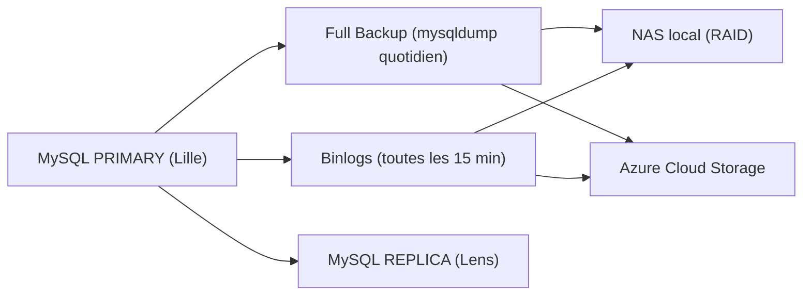

# **Schémas**

Cette section regroupe les schémas utilisés pour illustrer les mécanismes de sauvegarde et de supervision de la base WMS.  

---

# **1. Schéma de la stratégie de sauvegardes (MySQL)**

---

# **2. Schéma du pipeline de supervision**

---

# **3. Conclusion**

Ces schémas illustrent visuellement les mécanismes essentiels qui garantissent la continuité et la disponibilité du WMS :

- une stratégie de sauvegarde robuste (binlogs + full backups + redondance NAS/Azure)
    
- une supervision proactive permettant de détecter les anomalies avant qu’elles n’affectent l’activité
